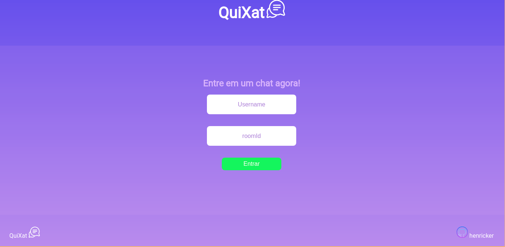
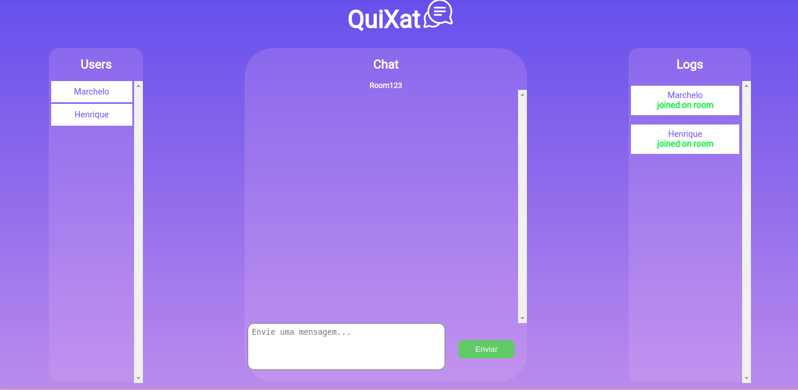
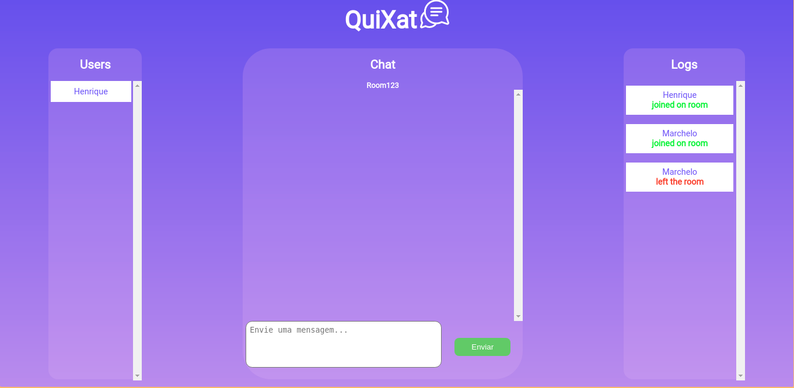
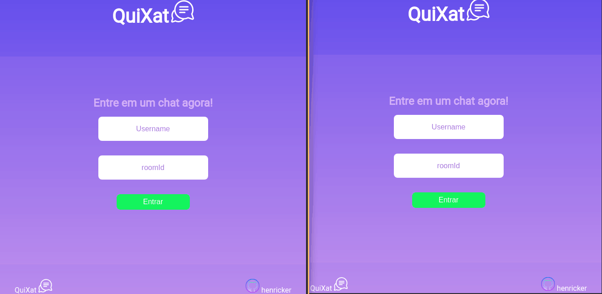

# QuiXat in progress...

## Techs
- NodeJs
- Socket.io
- HTML, CSS and Js pures

## About
- Quixat is a real-time application that I am developing during the holidays, in order to specialize a little with sockets and nodeJs programming, in addition to venturing into the world of the frontend where I am developing the interfaces. It is a simple project, but it will propose a lot of knowledge for me :)

## Features added
  
- [x] List users in chat
- [x] List logs in chat (user in, user out)
  
  

- [x] Conversation by roomId
- [x] Send and receive message
  

- [ ] Share images and videos
